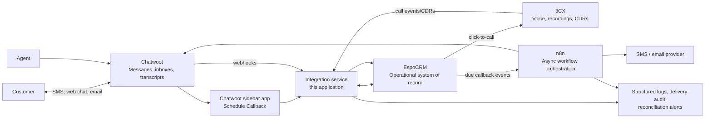

# Customer Engagement and Callback Management Platform

## 1. Executive decisions

| Decision | Recommendation | Why |
| --- | --- | --- |
| System of record | EspoCRM is authoritative for customer contacts, callbacks, callback assignments, and callback outcomes in the MVP. Leads, opportunities, and jobs are deferred. | Callback accountability is the immediate operational need; pipeline and job data can be added after the callback workflow is proven. |
| Conversation hub | Chatwoot is authoritative for message delivery, conversation state, attachments, and complete transcripts. | It is purpose-built for omnichannel messaging and agent work. |
| Voice system | 3CX is authoritative for call control, recordings, and call-detail records. | A voice call cannot practically originate from Chatwoot; agents launch it from the CRM callback record into 3CX. |
| Integration pattern | Build a small, versioned integration service in this application first; use n8n only for asynchronous, non-critical orchestration. | The callback creation, identity matching, and idempotency paths must be testable and reliable. n8n remains valuable for notification and campaign workflows. |
| Conversation storage | Store a current CRM-facing summary and selected milestones in EspoCRM, not every message. Keep a stable Chatwoot deep link and transcript reference. | Prevents CRM noise while retaining operational context and the source transcript. |
| MVP interaction | A Chatwoot sidebar/dashboard app calls the integration service to create or update the EspoCRM contact and create a callback. Retain a prefilled EspoCRM deep link as a safe fallback. | This is lower-friction than hand entry and more reliable/auditable than parsing every message automatically. |

### Assumptions to challenge

1. "All communications originate in Chatwoot" should apply to SMS, web chat, email, and social channels. Voice calls should originate in 3CX, with their business result tracked in EspoCRM and a link back to the Chatwoot conversation where applicable.
2. A customer SMS 15 minutes before every callback can be surprising or non-compliant. The callback owner should choose `send_customer_reminder`, with consent and quiet-hours checks; employee reminders should be the default.
3. Full transcripts in EspoCRM make search, retention, access control, and reporting worse. Store summaries plus high-value milestones instead.
4. Do not start with automatic intent extraction. It should propose a callback only after the manual path is established and measured.

### Why the MVP must be callbacks only

Building Leads and Opportunities now would not make a promised callback more likely to happen. It would add status definitions, conversion rules, reporting, permissions, migration, and user-training decisions before the team has validated the core workflow.

Sprint 1 therefore includes only **Contact + Callback + Call activity**. A callback requires a customer, owner, reason, due time/timezone, status, and outcome; it does not require a Lead or Opportunity. The integration design keeps the Callback entity extensible, but no pipeline entities, pipeline dashboards, or pipeline automation are built or required in the callback MVP.

## 2. Solution architecture

### Core flows

**Inbound message and identity**

1. Chatwoot receives an inbound message and emits a signed webhook.
2. The integration service deduplicates the event, normalizes the phone/email, resolves the brand inbox, and finds or creates the EspoCRM Contact.
3. It records Chatwoot account, inbox, contact, and conversation identifiers on the Contact. It stores only meaningful lifecycle milestones or a refreshed summary in CRM.
4. The service writes the EspoCRM contact and customer-facing URL into Chatwoot contact custom attributes, letting agents move between systems without searching.

**Agent-scheduled callback**

1. Chatwoot sends the embedded Dashboard App the currently selected conversation and contact context. When the agent changes conversations, the sidebar refreshes to that newly selected context.
2. The sidebar prepopulates the customer's name, normalized phone/email, Chatwoot contact ID, conversation ID/URL, inbox/brand, assignee, and current labels. The agent selects only a reason, owner, due date/time, timezone, and optional customer reminder.
3. The sidebar submits the context identifiers and callback form values to the integration service.
4. The service re-fetches and validates the submitted conversation and contact from Chatwoot; it does not trust iframe-provided identifiers alone. It then validates an unambiguous customer identity, upserts the Contact, creates an EspoCRM Callback, and returns the callback number and CRM URL.
5. The service applies the `A_pending_callback` Chatwoot label. It removes it only when no open callback remains for that conversation/contact.
6. The callback is immediately visible in the EspoCRM owner queue and dashboard.

**Callback due, call, and outcome**

1. EspoCRM's scheduler identifies callbacks due in 15 minutes and emits a durable outbox event.
2. n8n consumes the event idempotently, observes consent and quiet hours, sends approved reminders, and records each delivery result against the callback.
3. At the callback time, the employee clicks `Call via 3CX` in EspoCRM. The CRM integration triggers 3CX click-to-call using the employee's configured extension.
4. 3CX posts call completion data to the gateway. The gateway correlates it to the callback and creates/updates a CRM Call activity without marking the callback complete.
5. The employee must choose an outcome. Completion, rescheduling, and escalation rules update the callback and Chatwoot labels.

## 3. Ownership and synchronization policy

| Data | Authoritative system | Sync direction | CRM representation |
| --- | --- | --- | --- |
| Contact identity, normalized phone/email, address, consent | EspoCRM | Bidirectional only for approved identity fields; CRM wins conflicts | Contact |
| Chatwoot contact/conversation IDs, inbox, URL | Chatwoot | Chatwoot to CRM; CRM IDs returned as Chatwoot custom attributes | Contact integration fields |
| Individual messages, attachments, delivery events | Chatwoot | Do not replicate by default | Chatwoot link; selected milestones only |
| Current conversation summary | Integration service, from approved agent/AI summary | To CRM on explicit save or defined lifecycle event | Communication record / Contact summary |
| Callback promises, ownership, due time, outcome | EspoCRM | CRM to Chatwoot status label and optional message only | Callback |
| Voice call control, recording, raw CDR | 3CX | 3CX to CRM | Call activity with recording reference |
| Pipeline, opportunity, job, payment status | Deferred until the callback MVP is stable | No MVP synchronization | Future scope |

### Transcript policy

- **Do not store full transcripts in EspoCRM by default.** Keep them in Chatwoot under its retention and access policies.
- Store a short, structured `latest_conversation_summary` on the Contact and an immutable Communication record for important events: intake submitted, estimate requested/sent, callback promised, complaint/escalation, job scheduling, consent change, and handoff.
- Each Communication record includes Chatwoot conversation ID, message permalink, channel, direction, author, timestamp, and optional redacted summary.
- Allow a privileged, explicit “snapshot transcript” action for legal/complaint cases only. Mark it with retention class and reason; do not implement bulk automatic snapshots.

## 4. EspoCRM data model

Use EspoCRM's standard entities where possible. Create custom entities only where workflow semantics are not an Activity.

### Contact

One person or organization contact, shared across brands where appropriate.

| Field | Type / rule |
| --- | --- |
| `id`, `name`, `phoneNumber`, `emailAddress`, `address*` | Standard fields. Retain every known phone/email as a Contact value; display values preserve customer formatting and the gateway derives normalized matching keys. |
| `primary_brand` | Enum, not a hard partition; preserves the brand most relevant to current service. |
| `brand_relationships` | Link/multi-enum for brands the customer has used. |
| `chatwoot_url` | Convenience deep link to the active/recent Chatwoot context; it is not the identity key. |
| `sms_consent_status`, `sms_consent_at`, `consent_source` | Required before non-transactional SMS. |
| `latest_conversation_summary`, `summary_updated_at` | Short operational context, not a transcript. |
| `identity_match_status` | `confirmed`, `review_required`, `unmatched`; ambiguous matches never auto-merge. |

MVP relationships: one-to-many Callbacks, Call activities, and Communications. Lead, Opportunity, and Job relationships are future additions, not Sprint 1 scope.

### Thin identity foundation (required before callbacks)

This foundation gives EspoCRM one canonical Contact for a confidently matched person while preserving every system's original identifier. It does **not** import histories, transcripts, leads, opportunities, jobs, or personal mailboxes.

#### Data structure

| Record | Required fields | Purpose |
| --- | --- | --- |
| Contact | Standard name, phone/email values, `identity_match_status`, `primary_brand`, SMS-consent fields | The canonical EspoCRM customer record. A Contact may have multiple phones and emails. |
| External Identity Link (custom entity) | `source_system`, `external_id`, `contact_id`, `source_account_id`, `source_url`, `linked_at`, `linked_by`, `last_seen_at`, `link_status` | Links one source-system person record to one Contact. Use this instead of a growing set of `*_contact_id` fields. |
| Identity Review (custom entity or gateway queue) | source record and values, candidate Contact IDs, match evidence, status, reviewer, decision, audit timestamps | Holds ambiguous matches and merge candidates for human action. |

`External Identity Link` has a unique constraint on `(source_system, source_account_id, external_id)`. It represents sources such as `chatwoot`, `housecall_pro`, `supportpal`, `3cx`, and approved shared email. A Chatwoot **conversation** is context, not identity: store it on Callback/Communication records and never use it as the unique customer key.

#### Canonicalization

Normalize only for matching; retain original values for display and outbound use.

| Identifier | Matching key |
| --- | --- |
| Phone | Parse with a real phone library, apply the source/default country only when known, and store canonical E.164 (for example, `+12065551212`). Invalid or extension-only values are not automatic-match keys. |
| Email | Trim surrounding whitespace and compare case-insensitively. Do not remove dots, plus-address suffixes, or alter the local part; providers treat these differently. Invalid addresses are not automatic-match keys. |
| External ID | Treat the source system, source account, and source record ID as an opaque composite key. Never derive it from a name, phone, or email. |

#### Matching decision table

| Evidence on an incoming source record | Action |
| --- | --- |
| Existing active External Identity Link | Use its linked Contact. |
| Both a normalized phone and normalized email match the same Contact | Auto-link to that Contact and record the match evidence. |
| Exactly one normalized phone **or** one normalized email matches one Contact, with no conflicting identifier | Create a `provisional` link and show the match to the agent; promote to `confirmed` after agent confirmation. (HCP's stronger auto-confirm rule below does not apply here — single-identifier matches always need a human, regardless of source.) |
| Phone and email match different Contacts, an identifier matches multiple Contacts, or a source record is already linked elsewhere | Create an Identity Review; do not create a Callback until an agent selects the Contact or creates a new one. |
| No match | Create a new Contact plus a `provisional` source link; the agent confirms it before a customer reminder can be sent. |

Never automatically merge Contacts. A merge is a privileged, audited operation that moves Identity Links, open Callbacks, and approved non-duplicate fields to the surviving Contact while retaining a redirect/merged record reference.

#### Trusted-source auto-confirm policy (HCP only, MVP)

Every source above requires agent confirmation for a provisional (single-identifier) match by default. **HCP is the one exception**, because HCP customer records are staff-entered at time of booking and are meaningfully more reliable than customer-entered contact info from Chatwoot/email/SupportPal. This exception applies to HCP only; all other sources keep full manual confirmation until real match volume justifies revisiting this.

| HCP match evidence | Action |
| --- | --- |
| Phone **and** email both match the same Contact, **and** the HCP customer's name is not materially different from that Contact's name (passes the name-similarity check in Section 11a) | **Auto-confirm** — no agent step. This is expected to cover the large majority of real HCP matches. |
| Only phone matches, or only email matches (regardless of name) | Stays `provisional` — requires agent confirmation. A single matching identifier is exactly where a typo or coincidental match is most likely, so this case is deliberately kept conservative. |
| Both phone and email match, but the name is materially different | Downgrade to an **Identity Review**, never auto-confirm — this is the household/shared-identifier case (Section 11a), and auto-confirming here would silently merge two different people's records. |

Auto-confirmed HCP links are still recorded with full match evidence and an actor of `system:hcp-auto-confirm` in the audit trail, so they remain reviewable after the fact even though no agent acted at link time.

#### Worked scenario: Contact exists in EspoCRM first, then staff creates them in HCP

This is expected to be a common path (a customer texts/emails in, gets an EspoCRM Contact from Chatwoot/email, and later staff books their job directly in HCP) and it is handled by the same resolver as every other source — there is no special case to build.

1. A Contact already exists in EspoCRM (say, matched by email from an earlier conversation) with no `housecall_pro` External Identity Link yet.
2. Staff creates that person as a new customer directly in HCP, using the same email or phone.
3. The next HCP sync pass (dry-run report or live sync) evaluates that HCP customer against the matching decision table above. A matching email or phone resolves to the existing Contact as a `provisional` link; once confirmed (by an agent, or a configured trusted-source auto-confirm policy for HCP specifically, since staff-entered HCP data is generally reliable), the `housecall_pro` External Identity Link attaches to the **existing** Contact — no duplicate Contact is created.
4. From that point on, the HCP customer and the EspoCRM Contact are the same linked record; later HCP updates (job history, address) flow into that same Contact.

**Two edge cases this depends on getting right, not yet fully covered by the general rules:**

- **Near-match instead of no-match.** If staff types a slightly different phone/email in HCP than what's already in EspoCRM (a typo, a secondary personal email, a different phone), the resolver sees no matching identifier and treats it as brand-new — creating a duplicate Contact rather than an Identity Review. The general "No match" row does not currently distinguish *genuinely new person* from *existing person, mismatched identifier*. Mitigate with a periodic **fuzzy duplicate scan** (matching normalized name + service address, or name + partial phone) that raises likely duplicates as Identity Reviews rather than relying on exact-match alone at sync time.
- **HCP customer created with no email or phone at all** (name-only, common for a fast phone-booked job). There is nothing to match on, so this always creates a new Contact. Treat this the same as the fuzzy-duplicate case above — the periodic scan is the safety net, not the real-time sync.

Both edge cases are Sprint 0/2 hardening work, not blockers to starting: they should be resolved by adding the fuzzy-match sweep as an explicit, recurring job (nightly, alongside the existing identity reconciliation automation) rather than expecting the real-time resolver to catch them at sync time.

#### Callback-time behavior

The Chatwoot Dashboard App asks the gateway to resolve the selected Chatwoot contact before displaying the callback form:

1. A confirmed link returns the Contact and open callbacks.
2. A provisional or ambiguous match presents a short **Confirm customer** choice rather than guessing.
3. The callback-create API uses the resolved `contact_id` and rechecks the Chatwoot account/contact/conversation server-side.
4. The gateway creates the callback only after an explicit Contact decision and stores the exact Chatwoot conversation as callback context.

#### Rollout sequence and success criteria

1. Configure Contact fields, External Identity Link, Identity Review, roles, and audit retention in EspoCRM.
2. Implement canonicalization, matching, link creation, review-queue API, and immutable audit events in the gateway.
3. Run a read-only Chatwoot matching report. Review collisions and tune the default phone country/trusted-source rules; do not bulk merge.
4. Enable Chatwoot contact linking and the callback flow. HCP and SupportPal later use the same resolver; 3CX and shared-email links are added only when their integrations are implemented.

The foundation is ready for callbacks when a repeated Chatwoot contact resolves to the same Contact, duplicate/replayed events create no extra Contact or Link, ambiguous cases are blocked into review, and an agent can resolve a review then schedule the callback against the selected Contact.

#### Reconciling the already-configured HCP and email integrations

HCP and personal email accounts are already configured in EspoCRM, but neither has run a real sync yet. This is the ideal time to route both through the identity foundation above, before Chatwoot is added as a third source. Do this work as part of Sprint 0, ahead of (or alongside) the Chatwoot-specific work.

**HCP connector — decide the write target before enabling it**

- The connector must create/update the standard **Contact** record (through the same matching decision table used for Chatwoot), not a separate "HCP Customer" entity and not a bespoke set of fields bolted onto Contact ad hoc.
- Register `housecall_pro` as a `source_system` in External Identity Link, keyed by the HCP customer ID (`source_account_id` = your HCP account; `external_id` = HCP customer ID). This is the same mechanism already specified for Chatwoot — no new data model is needed.
- Treat HCP as a **read source of truth for job/service history**, but not an automatic authority over identity fields it didn't originate — an HCP sync should add/update phone, email, and address values, not silently overwrite a value an agent already corrected in EspoCRM. Use "add if missing, flag if conflicting" rather than blind overwrite.
- Before turning on live writes: export current HCP customers and run them through the matching resolver in **dry-run** (report only), applying the HCP trusted-source auto-confirm rule (above) to see what it would have auto-confirmed vs. left provisional/review. Expect four buckets — auto-confirmed, provisional/needs agent confirmation, Identity Review (ambiguous/name-mismatch), and net-new. Review the review/new counts before enabling writes; if the number of ambiguous matches is large, tune the phone-country default and re-run rather than proceeding.
- Only after the dry-run looks reasonable, enable live sync so HCP customer create/update events flow through the resolver like any other source.

**Personal email accounts — lock down behavior, don't disable**

- Personal Email Accounts in EspoCRM match mail to an *existing* Contact by email address; by default they should not be configured to auto-create new Contacts. Confirm this setting explicitly for every configured account — do not assume it.
- Because these are personal inboxes, two governance gaps are common and should be closed now: (1) matched emails are often visible only to the owning user unless team/Contact-level sharing is enabled — turn this on so a callback agent working a Contact can see relevant email history, not just the original recipient; (2) personal inboxes contain non-customer mail, so email address alone should never be trusted as a *sole* signal for creating a new Contact — it should only ever match an existing one.
- Run a one-time audit now, before more mail accumulates: check whether any personal account has already auto-created Contacts, and check whether any existing Contacts were created from a stray non-customer address (vendor, internal, personal correspondence). Send anything suspicious to the Identity Review queue rather than deleting/merging directly.
- No new External Identity Link entries are needed for email — the Contact's `emailAddress` value already is the matching key, and EspoCRM's native email-to-Contact linking is the mechanism. The governance work is entirely about *auto-create* and *sharing* settings, not new data structures.

**Net effect:** once both are reconciled this way, HCP and email stop being two independent, ungoverned integrations and become two more sources feeding the same Contact/External Identity Link/Identity Review model that Chatwoot will use next. Nothing here requires Leads, Opportunities, Jobs, or transcript storage — it is strictly identity hygiene on data you already have.

**HCP tags — the existing brand/service-line signal, now feeding Contact instead of only comms**

HCP customer tags already exist and already mean something operationally: `applyCustomerTag` (`src/hcp.js`) unions a tag onto a customer, and the intake flow (`src/intake.js`) uses that same `customer_tag` to resolve a brand for Chatwoot inbox routing and branded email (`resolveBrand`, `src/brands.js`). This is the natural, already-built source for "which type of customer is this," and the identity foundation should consume it rather than invent a separate tagging mechanism:

- On HCP sync (dry-run and live), copy each HCP customer's tags into the linked Contact's `brand_relationships` (additive/union, mirroring `unionTags` — never remove a brand relationship because a sync omitted a tag).
- Set/update `primary_brand` from the **most recently applied** tag for that customer, since a repeat customer's most recent service is the more relevant brand context for a new callback or conversation.
- Treat HCP as authoritative for this signal specifically, since tagging already happens there operationally today; a Contact created first in EspoCRM (Chatwoot/email/intake) simply has no `brand_relationships` yet until an HCP tag or the intake's own `resolved_brand` populates one.
- If Chatwoot/intake and HCP disagree on brand for the same Contact (e.g., intake resolved one brand, HCP tags show another), don't silently pick one — surface both on the Contact, same as the general field-conflict rule in Section 11a, so an agent can confirm the right one rather than the callback routing to the wrong brand's inbox/SLA.

#### Contact creation direction: EspoCRM is the identity system of record, HCP is not

The matching rules above answer "how do we link a Contact once one exists in both places." A separate question is "which system is allowed to originate a new person record, and does it push to the other." The two systems have different scopes, so the answer is direction-aware rather than a single system-of-record rule:

| Where the Contact is created | What happens |
| --- | --- |
| Inbound to EspoCRM (Chatwoot conversation, SupportPal intake, personal email match, manual entry) | Create/update the Contact in EspoCRM only. **Do not** push it to HCP automatically. Most inbound contacts are inquiries, unqualified leads, no-shows, or non-customer correspondence that never become a paying job — pushing every one to HCP would pollute HCP's customer list with people who never book. |
| Created directly in HCP (staff books a job/estimate straight in HCP, or an HCP-native intake path) | HCP sync brings it into EspoCRM through the normal matching resolver (confirmed / provisional / review / new), exactly like today's dry-run/live-sync path. HCP remains the source of truth for job and service history for that person. |
| An EspoCRM Contact is promoted to an actual customer (estimate/job is about to be created for them) | This is the one explicit, human/workflow-triggered action that creates the HCP customer from the EspoCRM Contact — for example when an agent uses the existing HCP estimate-builder flow (`createCustomer` in `src/hcp.js`) or a future "Send to HCP" action on the Contact. On success, write the returned HCP `customer_id` back into that Contact's `housecall_pro` External Identity Link so the pair is linked from that point forward and future HCP syncs recognize it instead of creating a duplicate. |

In short: **EspoCRM is the universal identity system of record; HCP is the system of record only for people who have become actual service customers.** A Contact is allowed to exist in EspoCRM alone indefinitely (a lead who never converts). A Contact should never be allowed to exist in HCP without a corresponding EspoCRM Contact + External Identity Link — that linkage is what the HCP dry-run/live-sync step in Sprint 0 guarantees for existing HCP customers, and what the promotion action guarantees for new ones going forward.

This also means "add a Contact in EspoCRm but not in HCP" is not an error state — it is the expected, common case, and no automation should try to auto-create an HCP customer just because an EspoCRM Contact was created. HCP creation happens only at the moment real business justifies it (an estimate or job), triggered by a person, not a background sync.

### Lead (deferred)

Use a Lead for an unqualified inquiry. Convert it to an Opportunity when it is qualified.

| Field | Type / rule |
| --- | --- |
| `status` | `New`, `Contacted`, `Estimate Scheduled`, `Estimate Sent`, `Follow-Up`, `Won`, `Lost`, `Disqualified`. |
| `source`, `source_detail`, `campaign` | Captures Chatwoot inbox/channel, Google LSA, Thumbtack, referral, and campaign detail. |
| `brand`, `service_line`, `service_address` | Required for routing and reporting. |
| `owner_user_id`, `assigned_at` | Required. Unassigned Leads appear in an exception queue. |
| `next_action_at`, `next_action_type` | Enables no-lead-left-behind enforcement. |
| `lost_reason`, `lost_at` | Mandatory when status is Lost. |

### Opportunity (deferred)

Use an Opportunity for a qualified sale/estimate. It may originate from one Lead; avoid forcing every callback into an Opportunity.

| Field | Type / rule |
| --- | --- |
| `stage` | `Qualified`, `Estimate Scheduled`, `Estimate Sent`, `Negotiation`, `Won`, `Lost`. |
| `amount`, `probability`, `expected_close_date` | Sales forecasting. |
| `estimate_reference`, `estimate_sent_at` | Link to Housecall Pro or estimate-builder record. |
| `next_action_at` | Required while open. |

### Callback (custom entity)

A Callback is a promised future action, not merely a generic Task. It needs its own SLA, reminder, and escalation history.

| Field | Type / rule |
| --- | --- |
| `callback_number` | Human-readable, immutable reference. |
| `status` | `Scheduled`, `Due Soon`, `In Progress`, `Completed`, `Overdue`, `Cancelled`, `Escalated`. |
| `due_at_utc`, `timezone` | Store UTC plus the IANA timezone selected from service/customer location. Never store a local time without timezone. |
| `reason`, `notes` | Structured reason enum plus short free text. |
| `owner_user_id`, `backup_owner_user_id`, `team_id` | Owner is required; backup supports escalation. |
| `contact_id` | Required in the MVP. |
| `chatwoot_conversation_id`, `chatwoot_url` | Context link. |
| `customer_reminder_enabled`, `customer_reminder_at`, `employee_reminder_at` | Explicit opt-in for customer reminder. |
| `outcome` | `Completed`, `No Answer`, `Left Voicemail`, `Rescheduled`, `Estimate Sent`, `Follow-up Required`, `Won`, `Lost`. |
| `completed_at`, `completed_by`, `attempt_count`, `last_attempt_at` | Supports coaching and SLA reporting. |
| `rescheduled_to_callback_id`, `escalation_level` | Preserve history; reschedule creates a new callback rather than overwriting the promise. |
| `idempotency_key`, `source_event_id` | Prevent duplicate creation. |

MVP relationships: belongs to Contact; one-to-many reminder deliveries and linked Call activities. Lead, Opportunity, and Job links are deferred.

### Job

Use a custom Job entity if Housecall Pro is not the job system of record; otherwise create a read-only synchronized Job projection.

| Field | Type / rule |
| --- | --- |
| `status` | `Scheduled`, `In Progress`, `Completed`, `Invoiced`, `Paid`, `Cancelled`. |
| `scheduled_start_at`, `scheduled_end_at`, `crew/team`, `service_address` | Dispatch views. |
| `external_job_id`, `external_url` | Source-system linkage. |
| `brand`, `service_line`, `amount` | Cross-brand reporting. |

### Activities and Communications

| Entity | Use |
| --- | --- |
| Task | Internal work that is not a customer promise. |
| Meeting | Estimate appointment or site visit. |
| Call | Completed or attempted voice call from 3CX; include duration, disposition, and recording URL/reference. |
| Communication (custom) | Curated Chatwoot event/summary, not raw message archive. |
| Callback Attempt (custom, optional in MVP) | One row per outbound callback attempt; use once multiple attempts and detailed SLA analysis are needed. |

## 5. User experience and recommended implementation

### Options evaluated

| Option | Benefits | Limitations | Decision |
| --- | --- | --- | --- |
| Chatwoot “Schedule Callback” sidebar app | Contextual, structured, no duplicate entry, can return confirmation, supports validation. | Requires a small embedded app/API integration. | **Recommended MVP.** |
| Prefilled EspoCRM deep link | Fast to deploy, uses CRM-native forms and permissions. | Agent still changes applications and can abandon the record; harder to enforce idempotency. | **Required fallback and pilot path.** |
| Webhook-driven automatic creation | Zero click for clear requests; useful later at scale. | NLP mistakes can create unwanted customer promises; needs approval and confidence controls. | **Phase 3, proposal-only first.** |

### Agent workflow

1. Open a Chatwoot conversation; the Dashboard App receives its current contact and conversation context, then shows the Contact, open callbacks, and a CRM link.
2. Select **Schedule Callback**; the customer, brand, and exact conversation are already populated.
3. Choose the due time in the customer/service timezone, reason, owner, and customer-reminder preference.
4. Submit; see the callback number, due time, and status without leaving Chatwoot.
5. The CRM owner works the callback from EspoCRM's queue, clicks **Call via 3CX**, and records an outcome before leaving the record.

### Guardrails

- Do not allow a callback without Contact, owner, reason, time, and timezone.
- The sidebar must clear and reload its state whenever Chatwoot changes the selected conversation; it must never submit stale context from a previously selected conversation.
- The integration service must re-fetch the submitted Chatwoot conversation, verify it belongs to the submitted contact/account/inbox, and reject mismatches with an actionable agent error.
- Warn on an existing open callback for the same Contact/reason/time window; offer to open it instead of silently duplicating it.
- Define an owner fallback queue for inactive/absent users.
- A callback cannot transition to `Completed` without an outcome; `Rescheduled` creates a linked new callback.
- `Won` and `Lost` outcomes require the linked pipeline record to update in the same transaction/outbox operation.

## 6. Dashboards and operational controls

### Callback command center

- **Upcoming:** scheduled through end of day, grouped by owner and due window.
- **Due Soon:** next 15 minutes and unacknowledged.
- **Overdue:** past due, colored by elapsed SLA, with escalation owner/status.
- **Exceptions:** unassigned, failed reminder, unmatched identity, duplicate candidate, or stale `In Progress`.
- Filters: brand, team, employee, callback reason, status, and timezone.

### Lead pipeline (deferred)

Counts and conversion/time-in-stage for `New`, `Contacted`, `Estimate Scheduled`, `Estimate Sent`, `Follow-Up`, `Won`, and `Lost`. Every open lead must have `owner` and `next_action_at`; show a “no next action” exception tile.

### Jobs

Counts/value and aging for `Scheduled`, `In Progress`, `Completed`, `Invoiced`, and `Paid`. Keep job and invoice data synchronized from the system that truly owns it; do not make CRM users update both systems.

### Service-level indicators

- Callback completion by promised time
- Median time to first human response
- Overdue callback count and age
- Reminder delivery success/failure
- Contact-to-estimate and estimate-to-win conversion
- Unassigned callback count and oldest age

## 7. Integration technical design

### Shared integration contract

Build the gateway as explicit APIs in this application (`/api/integrations/...`), protected by service-specific credentials. Persist an integration-event ledger with: source, event ID, event type, received/processed timestamps, normalized identity keys, target IDs, attempt count, terminal status, and sanitized error code. Unique `(source, event_id)` makes webhook handling idempotent.

Use an outbox table for state changes that need downstream delivery. The CRM write and outbox insert are one database transaction; retry delivery with bounded exponential backoff and expose exhausted messages in an operator queue. Never retry customer messages blindly after an ambiguous timeout: query the provider's message/event ID first.

### Chatwoot ↔ EspoCRM

| Area | Design |
| --- | --- |
| APIs | Chatwoot account/contact/conversation/message APIs; EspoCRM REST APIs for Contact, Callback, Call, Communication, and user lookup. |
| Webhooks | Chatwoot contact/conversation/message/status events to gateway; CRM callback/contact changes via webhook if supported, otherwise outbox/scheduled reconciliation. |
| Authentication | Chatwoot API access token stored server-side; EspoCRM API key/OAuth service account with least-privilege roles. Rotate through secret storage, never browser configuration. |
| Identity | Normalize E.164 phone and lowercased canonical email. Match by an existing external ID first, then exact verified phone/email. Flag ambiguous matches for review. |
| Errors | Acknowledge only after durable event receipt; classify validation vs retryable service failure. Reconcile open conversations and recently updated contacts daily. |
| Audit | Record actor, source event, before/after external IDs, and a correlation ID. Exclude raw transcript body and secrets from logs. |

### EspoCRM ↔ 3CX

| Area | Design |
| --- | --- |
| APIs | Use the supported 3CX CRM/click-to-call integration or Call Control API for the deployed 3CX edition; use CRM APIs to create Call activities and update Callback records. Validate edition/licensing before implementation. |
| Webhooks | Consume supported 3CX call-state, completed-call, and recording-ready events; fall back to scheduled CDR import only if webhooks are unavailable. |
| Authentication | Dedicated 3CX integration account/API client; map EspoCRM user to a single validated 3CX extension. |
| Correlation | Pass callback number/correlation ID where 3CX permits; otherwise correlate by extension, normalized number, start window, and call direction, then flag low-confidence matches. |
| Errors | A failed click-to-call is visible immediately to the agent and does not complete the callback. Uncorrelated CDRs go to an exception queue. |
| Audit | Store call ID, duration, disposition, linked callback, and recording reference—not the recording binary—in CRM. |

### Chatwoot ↔ 3CX

Do not create a direct real-time dependency for the MVP. Route all operational context through EspoCRM/the gateway:

- Chatwoot opens the callback context and CRM link.
- EspoCRM launches 3CX calls and owns outcome entry.
- Optionally post a short, approved Chatwoot private note after an outcome (for example, “Callback completed; estimate sent”). Never automatically publish sensitive call content to the customer conversation.

### n8n opportunities

Use n8n after the synchronous callback-create path is stable:

- Delivery of due-soon employee and opted-in customer reminders
- Missed-callback escalation sequences
- Estimate follow-up and re-engagement campaigns
- Daily reconciliation and exception alerts
- AI summarization jobs that write a proposed summary for agent approval
- Review request and job-completion workflows

Each workflow receives an immutable event ID and callback/CRM IDs; it must be safe to replay. n8n must not be the only store of business state or the only place an outcome is recorded.

## 8. Automation catalog

| Automation | Trigger | Action | Stop / safeguard |
| --- | --- | --- | --- |
| Employee callback reminder | Callback due in 15 minutes | In-app/email/SMS reminder with CRM/3CX links | Callback completed/cancelled; dedupe by callback and reminder type. |
| Customer callback reminder | Opted-in callback due in 15 minutes | Transactional SMS from correct brand inbox | Consent, quiet hours, delivery validation, one send per callback. |
| Due-time alert | Callback reaches due time uncompleted | Notify owner and mark `Due Soon`/`In Progress` appropriately | Owner acknowledges or outcome recorded. |
| Missed callback escalation | SLA grace period elapsed | Notify backup owner/team lead; mark `Escalated` | Resolved callback; no customer automation without review. |
| No-answer follow-up | Outcome `No Answer` or `Left Voicemail` | Create next callback according to policy and optionally send approved SMS | Maximum attempts, consent, customer response, owner override. |
| Estimate follow-up | Estimate sent with no decision | Task/reminder cadence and approved message sequence | Won/lost/opt-out/reply/active callback. |
| Stale-callback escalation | Callback remains `In Progress` past the allowed window | Create owner/team exception | Callback completed, rescheduled, or cancelled. |
| Job completion | Job becomes completed | Thank-you, review eligibility task, invoice workflow event | Payment/dispute/opt-out rules. |
| Review request | Eligible completed/paid job | One branded review-request message | Consent/quiet hours, no unresolved complaint, frequency cap. |
| Re-engagement campaign | Customer inactive for defined interval | Segmented approved campaign | Consent, suppression, active job/complaint/open callback. |
| Conversation summary proposal | Conversation closed or handoff occurs | Generate suggested short CRM summary | Human approval initially; privacy/redaction policy. |
| Identity reconciliation | Nightly | Detect unmatched/multiple CRM links | Human review; never auto-merge ambiguous records. |

## 9. Delivery roadmap

### Phase 1 — Must have: reliable callback MVP

**Sprint 0 — Identity foundation and policy (1.5–2 weeks)**

- Objective: establish the callback identity foundation, environments, data governance, and test accounts — and bring the already-configured HCP and personal-email integrations under that same foundation before Chatwoot is added.
- User stories: as an agent, I can resolve a Chatwoot customer to one safe CRM Contact before scheduling a callback; as a manager, I can review ambiguous matches rather than silently creating duplicates; as an administrator, I know exactly what the HCP connector writes and that personal email accounts cannot silently create duplicate Contacts.
- Work threads (sequenced; B depends on A, C depends on B):
  - **A. EspoCRM data model (~2–3 days).** Configure Contact fields (identity/consent/brand fields), the External Identity Link entity (with its unique `(source_system, source_account_id, external_id)` constraint), the Identity Review entity/queue, roles/permissions, and audit retention settings. Set the fixed `source_account_id` constant for `housecall_pro`. No dependencies — can start immediately given confirmed EspoCRM admin/API access.
  - **B. Resolver logic (~3–5 days).** Implement phone/email canonicalization, source-ID link lookup, the matching decision table, the name-similarity downgrade check, the HCP trusted-source auto-confirm rule, field-conflict surfacing (never silent-overwrite), the source-scoped consent-events log, and replay-safe/idempotent event handling with immutable audit events (including `system:hcp-auto-confirm` as a recorded actor). Depends on Thread A's entities existing.
  - **C. Reconcile existing integrations (~2–3 days).** Run the HCP dry-run customer export through the resolver (four buckets: auto-confirmed, provisional, review, new); tune and re-run if the review/new ratio is high; map HCP tags into `brand_relationships`/`primary_brand` per the rule above. Separately, audit and lock down personal email account auto-create and sharing settings, and review any Contacts already created from stray non-customer addresses. Depends on Thread B's resolver being functional.
- Also in scope: confirm Chatwoot, EspoCRM, and 3CX versions/licensing; create service accounts; define brands, timezones, consent policy, retention/deletion workflow ownership, callback SLA, and outcome taxonomy; establish secret management and a non-production test tenant; add the standing duplicate-rate KPI to the dashboard backlog (Section 11a) for later sprints.
- Dependencies: EspoCRM admin/API access (confirmed available) and HCP read-scope API access for the customer export (confirmed available); an agreed brand/user roster.
- Risks: unsupported 3CX API/edition, absent SMS consent data, invalid source phone country, duplicate contacts, HCP/email retroactively creating unreviewed duplicates if enabled before the resolver is in place, and underestimating Thread B if the name-similarity/conflict logic proves more involved than expected.
- Acceptance: field/data dictionary approved; sandbox connectivity verified; a replayed source record creates no duplicate Contact/Link; a confident two-identifier HCP match auto-confirms and is still visible in the audit trail; a single-identifier match (any source) requires agent confirmation; a name-mismatch match creates an Identity Review and cannot create a callback until an agent decides; HCP dry-run report reviewed with an acceptable review/new ratio before any live write is enabled; HCP tags observed flowing into `brand_relationships`/`primary_brand` correctly in the dry-run; personal email auto-create and sharing settings are confirmed and documented; architecture decision record signed off.

**Sprint 1 — Callback-only operational model (1–2 weeks)**

- Objective: make EspoCRM usable as the callback system of record without Leads, Opportunities, Jobs, or automation.
- User stories: an agent can create, assign, reschedule, and complete a callback; a manager can see due-today and overdue work.
- Technical tasks: configure Contact fields required for callbacks; create Callback entity, Contact and Call relationships, layouts, validation/workflows, roles, callback number, dashboard/list filters, and migration/import plan for active promised callbacks. Do not configure Lead, Opportunity, Job, pipeline stages, or pipeline dashboards.
- Dependencies: Sprint 0 taxonomy and user/extension mapping.
- Risks: over-customizing CRM or mixing callbacks with generic tasks.
- Acceptance: required fields enforced; reschedule preserves history; due-soon/overdue dashboard works with seeded records; every outcome updates audit fields.

**Sprint 2 — Chatwoot identity and context integration (1–2 weeks)**

- Objective: eliminate duplicate customer lookup/data entry.
- User stories: an agent can open CRM context from a conversation; inbound Chatwoot contacts link to exactly one confirmed CRM contact or an exception queue.
- Technical tasks: webhook receiver, event ledger, normalized identity matching, Contact upsert, Chatwoot custom attributes, CRM/Chatwoot deep links, selected milestone sync, daily reconciliation job, unit/integration tests.
- Dependencies: EspoCRM API/service account and Chatwoot webhook signing.
- Risks: identity collisions and webhook retries/out-of-order delivery.
- Acceptance: duplicate webhook deliveries create no duplicate Contacts; ambiguous matches are reviewable; agents reach the linked Contact from Chatwoot in one click.

**Sprint 3 — Schedule Callback sidebar and queue (1–2 weeks)**

- Objective: create callbacks from Chatwoot in fewer than 30 seconds.
- User stories: an agent schedules a callback without retyping customer data; an owner sees it immediately; an agent can safely use a CRM fallback.
- Technical tasks: Chatwoot Dashboard App context listener and refresh handling; callback-create API and idempotency key; server-side Chatwoot context re-fetch/validation; open-callback lookup; label synchronization; prefilled CRM deep-link fallback; audit UI; and automated tests.
- Dependencies: Sprints 1–2.
- Risks: Chatwoot embedded-app capability/auth constraints; timezone mistakes.
- Acceptance: switching Chatwoot conversations refreshes the sidebar to the selected conversation/contact; the callback is created exactly once under retry/double-click and is linked to that exact validated Chatwoot conversation/contact; owner/timezone/reason are correct; it is visible in the CRM queue; and the fallback works if the sidebar is unavailable.

**Sprint 4 — Reminders, outcome discipline, and escalation (1–2 weeks)**

- Objective: prove that promises are kept.
- User stories: owners receive reminders; opted-in customers receive one; managers are alerted to misses; outcomes are consistently recorded.
- Technical tasks: CRM scheduler/outbox, n8n reminder workflow, delivery audit, quiet-hours/consent enforcement, escalation ladder, outcome workflows, exception dashboard, end-to-end failure simulation.
- Dependencies: Sprints 1–3 and a verified brand SMS sending path.
- Risks: accidental duplicate SMS, reminder delivery failure, unclear after-hours ownership.
- Acceptance: reminders are idempotent and auditable; simulated provider/API outage enters a visible exception state; overdue callbacks escalate within agreed SLA.

### Phase 2 — Should have: voice, then pipeline operations

**Sprint 5 — 3CX click-to-call and call correlation (1–2 weeks)**

- Objective: make the CRM callback record the single launch point for calls and outcomes.
- User stories: an employee launches 3CX from a callback; completed calls appear as linked activities.
- Technical tasks: extension mapping, click-to-call action, 3CX event/CDR ingestion, correlation rules, recording references, unmatched-call exceptions, user acceptance testing.
- Dependencies: Sprints 1–4 and confirmed 3CX supported integration surface.
- Risks: 3CX edition/API limitations and unreliable caller-ID correlation.
- Acceptance: >95% of controlled test calls correlate automatically; failures remain actionable and never falsely complete a callback.

**Sprint 6 — Lead, opportunity, and job dashboards (1–2 weeks)**

- Objective: unify callback accountability with revenue and delivery visibility.
- User stories: managers see pipeline and job status by brand; open leads always have a next action.
- Technical tasks: pipeline configuration, HCP/job-system projection decision, dashboard cards, SLA reports, source attribution, data quality exceptions.
- Dependencies: operational Lead/Opportunity adoption and an identified job/accounting system of record.
- Risks: competing status definitions across systems.
- Acceptance: dashboard totals reconcile to source records; a lead without owner/next action is visible within one reporting cycle.

**Sprint 7 — Campaign and lifecycle automations (1–2 weeks)**

- Objective: automate approved follow-up without losing human control.
- User stories: estimates receive appropriate follow-up; eligible customers receive review requests; resolved work stops messaging.
- Technical tasks: n8n event workflows, templates, suppression/opt-out checks, frequency caps, experiment/audit fields, campaign reporting.
- Dependencies: consent policy, templates, reliable status synchronization.
- Risks: brand/vertical copy errors, sending after a customer reply or complaint.
- Acceptance: all stop conditions pass automated test cases; every send links to campaign, customer, and source event.

### Phase 3 — Nice to have: intelligence and optimization

**Sprint 8 — AI-assisted summaries and callback suggestions (2 weeks)**

- Objective: reduce agent effort without autonomous promises.
- User stories: an agent reviews a suggested summary and callback draft; managers review accuracy.
- Technical tasks: redaction, prompt/version management, approval UI, confidence thresholding, evaluation dataset, feedback capture.
- Dependencies: stable MVP data, transcript-access policy, human-review process.
- Risks: privacy leakage, hallucinated commitments, biased lead scoring.
- Acceptance: agreed precision/recall targets on held-out conversations; no AI suggestion creates a callback without approval.

**Sprint 9 — Optimization and dispatcher copilot (ongoing)**

- Objective: prioritize work using measured outcomes.
- User stories: dispatcher sees recommended next best actions; sales receives evidence-based follow-up suggestions.
- Technical tasks: feature store/reporting, recommendation explanations, experiment controls, fairness/privacy review, audit logging.
- Dependencies: several months of clean outcome and timing data.
- Risks: optimizing vanity metrics instead of customer outcomes.
- Acceptance: controlled pilot improves an agreed SLA/conversion metric without increasing complaint/opt-out rate.

## 10. Prioritized backlog

| Priority | Deliverable |
| --- | --- |
| P0 | Callback custom entity, dashboards, required outcome/owner/timezone rules |
| P0 | Chatwoot-to-Espo identity link, event ledger, and deep links |
| P0 | Sidebar callback creation with CRM fallback and idempotency |
| P0 | Reminder delivery audit, escalation queue, consent/quiet-hours policy |
| P1 | 3CX click-to-call, call activity correlation, recording references |
| P1 | Lead/opportunity and job views, next-action data-quality controls |
| P1 | Estimate, review, and re-engagement automations with suppression |
| P2 | AI summaries, callback recommendations, sentiment, lead scoring |
| P2 | Dispatcher/sales copilots and experimentation |

## 11. Security, resilience, and operational readiness

- Give integration accounts only the entity/API permissions they need. Keep all tokens in server-side secret storage; never expose them to the Chatwoot sidebar.
- Verify webhook signatures, enforce HTTPS, reject stale/replayed signed events where supported, and rate-limit public webhook endpoints.
- Encrypt sensitive data at rest through the platform/database configuration. Redact phone/email/message content from application logs; restrict transcript/recording links through source-system permissions.
- Implement correlation IDs across Chatwoot event, CRM callback, 3CX call, n8n execution, and message provider delivery.
- Define alerts for webhook failures, dead-letter/outbox backlog, reminder failures, callback SLA breaches, reconciliation discrepancies, and integration authentication failures.
- Maintain runbooks for duplicate contact review, uncorrelated call review, customer-reminder failure, missed-callback escalation, and provider outage.
- Before production launch, test: duplicate webhooks, out-of-order webhooks, CRM timeout after accepted write, n8n replay, customer opt-out, DST transition, inactive callback owner, 3CX call failure, and delivery-provider outage.

## 11a. Known gaps and open decisions in the identity foundation

These are real unresolved items surfaced while designing the identity model, not documentation polish. Each should be explicitly decided (not defaulted by accident) before broad HCP live-sync and multi-source linking are enabled.

| Gap | Why it matters | Recommended default |
| --- | --- | --- |
| **Shared identifiers across distinct people** (a household or business sharing one phone/email) | The matching decision table links on phone/email equality; two different people sharing an identifier will be silently merged into one Contact, mixing their callback and job history. | Add a lightweight name-similarity check at match time: if the incoming name differs materially from the linked Contact's name, downgrade an otherwise-automatic match to an Identity Review instead of auto-linking. |
| **Field-conflict resolution when both systems disagree** (not blank-vs-filled, but two different real values, e.g., HCP has one phone and EspoCRM has a different one) | "Add if missing, flag if conflicting" was specified for the HCP sync, but no rule says which value wins or how a human is prompted to resolve it. | Never silently overwrite either side. Surface conflicting fields on the Contact as a visible "needs review" flag with both values shown; an agent chooses, and that choice is treated as authoritative going forward for that field. |
| **Consent is source-blind** | `sms_consent_status` is one flag on Contact, but consent captured through an HCP job-booking flow and consent captured through a Chatwoot conversation are contextually and often legally distinct (different disclosure text, different channel). | Record consent per source/channel (e.g., a small consent-events log: source, channel, timestamp, disclosure text/version), and derive the single `sms_consent_status` as the most permissive currently-valid consent — not a single unscoped flag. |
| **Data retention and deletion requests** | Identity now spans EspoCRM, Chatwoot, HCP, and email. A deletion/right-to-be-forgotten request has no defined fan-out path today. | Add a deletion-request workflow owned by the gateway: mark the Contact, cascade a deletion/anonymization signal to linked External Identity Links' source systems where each system's API/policy allows, and log what could vs. couldn't be removed (e.g., HCP financial/job records may have legal retention requirements that override a delete request). |
| **`source_account_id` for HCP is now trivial** | Confirmed: one shared HCP account across all brands. The field remains structurally useful (keeps the model consistent if a second HCP account or another multi-tenant source appears later) but should use one fixed constant value for HCP today rather than being treated as an open question. | Set a single fixed `source_account_id` for the `housecall_pro` source system now; do not build brand-specific HCP account handling until/unless a second HCP account actually exists. |
| **No ongoing production health metric for identity quality** | Sprint 0 acceptance criteria are one-time dry-run checks. Nothing measures whether duplicates creep back in after go-live. | Add a standing KPI to the dashboard/exception views (Section 6): weekly count of Contacts created via the "no match" path per source, and count of Identity Reviews resolved as "was actually a duplicate." A rising duplicate-resolution rate signals the matching rules need retuning. |

None of these block starting Sprint 0 — they are refinements to make during Sprint 0/2 hardening and before HCP live-sync is broadly enabled, not prerequisites to beginning the identity work.

## 12. Future AI roadmap

| Capability | Earliest phase | Human control |
| --- | --- | --- |
| Conversation summarization | Phase 3 | Agent approves CRM summary; source remains Chatwoot. |
| Callback recommendation | Phase 3 | Suggests prefilled form only; agent creates promise. |
| Estimate follow-up recommendation | Phase 3 | Recommends timing/message template subject to campaign rules. |
| Lead scoring | Phase 3 | Shows explanation and confidence; does not silently reassign or reject leads. |
| Sentiment/complaint detection | Phase 3 | Creates a review alert; no automatic customer response. |
| Dispatcher copilot | Phase 3 | Recommends priority/owner from SLA, availability, and geography; dispatcher confirms. |
| Sales assistant copilot | Phase 3 | Drafts notes/follow-ups from approved CRM and Chatwoot context; agent sends. |

AI is a later accelerator, not a dependency for callback reliability. The Phase 1 success measure is simpler: every open customer promise has a known owner, due time, visible status, and audited resolution.
