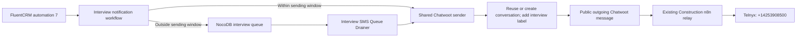

# Interview SMS through Chatwoot — production change record

Date: September 25, 2026

## Outcome

FluentCRM automation 7 now calls the production n8n webhook. Immediate and newly queued interview texts create public outgoing messages in Chatwoot's **4253908500 - Construction** inbox (account 1, inbox 17), apply the **interview** conversation label, and use the existing Chatwoot-to-Telnyx relay to send from **+14253908500**.

These changes were deployed and tested before this PR. The PR records the live configuration and validation; it does not deploy anything when merged.

## Changes recorded

### FluentCRM automation 7

- Kept the automation published and preserved all four steps, the email content, and trigger settings.
- Replaced `/webhook-test/b9e2849c-77df-471c-bf28-2db137eb4cdd` with `/webhook/b9e2849c-77df-471c-bf28-2db137eb4cdd` at `https://auto.unitedservicesnorthwest.com`.
- Verified POST + JSON subscriber data, including `custom_field`, match the n8n receiver. Verified the existing `x-webhook-secret` matches the receiver's credential without exposing either value.
- Read-back comparison showed only the webhook URL changed, excluding update timestamps.
- Trigger remains removal of tag ID 1 (title `Interview – Scheduled`, slug `applied`). Repeat enrollment remains disabled. The flow waits one minute, sends email, waits two minutes, then invokes the background webhook action.

### Interview workflows

| Resource | ID | Result |
| --- | --- | --- |
| Fluent CRM Interview SMS Sent Notification | `xqhebYkB9RAkM3QV` | Active; immediate sends invoke the shared Chatwoot sender |
| Interview SMS Queue Drainer | `MeXAMbO5QBDdOAf1` | Active; due queued messages invoke the same sender, one item per subworkflow execution |
| Interview SMS: Send via Chatwoot | `NqlHzbo0Sj5Bqq9S` | New, active shared workflow |
| Queue Sender (OpenPhone) | `mtGGD6ShDa3WGfx4` | Deactivated because OpenPhone was discontinued; definition retained |
| Telnyx SMS: Outbound (Construction 8500) | `dYJO2lOZH2nkaWfC` | Existing active relay reused; sends from +14253908500 |

The shared sender normalizes and validates the phone number, finds or creates a Chatwoot contact, reuses its inbox link, reuses the most recent conversation in inbox 17, and reopens that conversation if necessary. It reads and preserves existing labels, adds `interview`, and posts the message as public and outgoing. The account's `message_created` webhook forwards that message to the existing Construction relay.

The shared sender returns the original queue record ID and the Chatwoot message/conversation IDs. This allows the queue update to mark a successfully submitted message as handled. Its result is explicitly `submitted_to_chatwoot`: it is not proof of carrier delivery. The immediate notification's existing NocoDB log receives that submission status.

No new labels beyond `interview`, categories, or changes to unrelated booking-reminder workflows were included.

### Approved SMS wording

> Hi [first name], thank you for applying for the [position] position at United Services Northwest. Please schedule your Zoom interview here: https://www.unitedservicesnorthwest.com/schedule-your-phone-interview/
>
> We’ve also sent this link to your email. We look forward to speaking with you!

Missing fields fall back to `there` and `open`. The template applies to immediate messages and newly queued messages; previously queued messages keep their stored content.

## Verification

- Confirmed production n8n is on `10.0.10.25` (`automationserver`), configured for `auto.unitedservicesnorthwest.com`; `.102` is the staging instance.
- Verified all modified n8n workflows are active and their current versions are published. The Construction relay has a separate editor draft; verification used its actual published version without publishing or altering that draft.
- Verified the public route is reachable from WordPress without invoking the SMS workflow during configuration checks.
- Offline checks cover phone normalization, invalid-input rejection, existing/new contacts, inbox linking, conversation reuse/reopening, queue IDs, public outgoing messages, and preserving/deduplicating labels.
- An initial CLI attempt to test the label change failed at contact lookup because the CLI lacked its license provider. It did not reach message creation.
- A subsequent single test invoked the actual shared sender through an authenticated temporary wrapper on the live n8n runtime. The wrapper endpoint was deactivated immediately afterward; workflow `yhOK99utwdCbmQeu` remains inactive for audit.
- That test created Chatwoot message **11182** in conversation **433** and applied the **interview** label. The existing relay completed successfully in execution **463672**.
- Telnyx confirmed delivery to the authorized test recipient ending **1885**, from **+14253908500**, at **2026-09-25 17:52:14.515 UTC**. Provider message ID: `4031a0d9-b242-4cda-a9c7-80942abab2e5`.
- Earlier tests also verified the direct Chatwoot relay and revised SMS wording. The final test above exercised the shared sender and label step together.

## Remaining limitations

- The notification workflow still overrides the recipient with the existing fixed test number ending **1885**. Changing that override was outside the routing and message-content changes. Review it before sending to real candidates. The committed snapshot redacts that number.
- Existing scheduling uses a 9 a.m.–7 p.m. window and a next-9-a.m. queue target; it does not skip weekends or holidays. Business-day scheduling and timezone correctness in the queue parser were not changed or certified.
- WordPress CLI access could not inspect its scheduler because the SSH account cannot read `wp-config.php`. The final SMS test did not exercise FluentCRM tag removal, email delivery, its waits, or its background scheduler.
- The queue's `sent` marker now means submitted to Chatwoot, not Telnyx-delivered. End-to-end delivery retries and atomic queue claims were not added. Label updates also use a read/replace operation rather than an atomic append.
- Other booking reminder workflows still contain OpenPhone steps and were outside this change.
- The existing NocoDB logging/mapping was preserved; its content is not an independent carrier-delivery receipt.

## Backups and rollback

Pre-change snapshots were saved locally under `C:\Projects\_tmp`, including:

- `fluentcrm-funnel-7-before-webhook-fix-20260925T082221Z.json`
- `n8n-fluent7-before-sender-change-20260925T083722Z.json`
- `n8n-MeXAMbO5QBDdOAf1-before-queue-update-20260925T084243Z.json`
- `n8n-mtGGD6ShDa3WGfx4-before-queue-update-20260925T084243Z.json`
- `chatwoot-interview-routing-20260925T084803Z/` (workflow snapshots before Chatwoot routing)
- `n8n-fluent7-before-sms-content-20260925T090544Z.json`
- `interview-label-20260925T175006Z/sender-before.json` (shared sender before labeling)

Those local backups may contain secret headers and are intentionally not committed. A rollback requires reviewing and republishing the appropriate earlier n8n version with its existing credential bindings. Do not blindly restore the old test-webhook URL or reactivate the discontinued OpenPhone sender. Deactivate the affected notification/drainer first if sends need to be stopped. Reverting or merging this Git PR alone has no effect on the live services.
